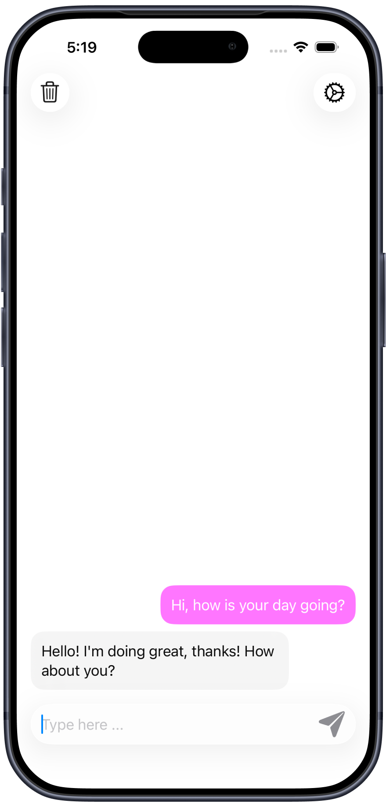
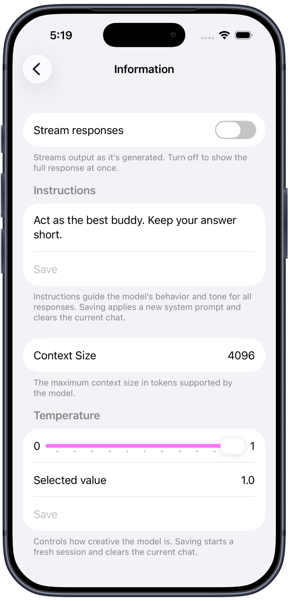
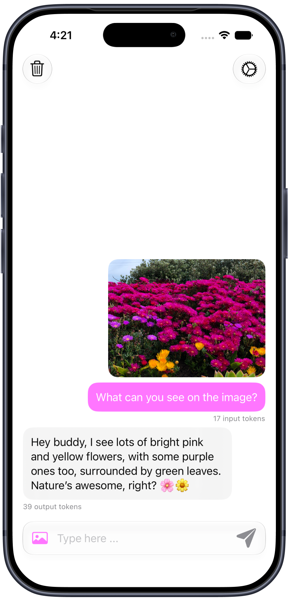
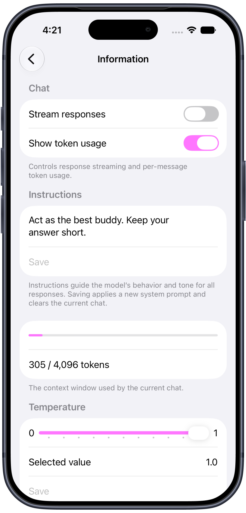

# Localight for iOS

[](https://opensource.org/license/mit)


**Localight** is a native SwiftUI chat app for iOS 26 and iOS 27, powered entirely by Apple’s on-device Foundation Models. Designed as a practical demonstration, Localight provides fast and private AI chat without an app server. Once the operating system has downloaded and prepared the model assets, response generation works offline.

Localight showcases how to integrate Apple’s on-device language model into a native iOS experience using SwiftUI and the [Foundation Models](https://developer.apple.com/documentation/foundationmodels) framework.

> [!WARNING]
> Localight is a demonstration app and is not production-ready. Model output may be inaccurate, incomplete, or misleading.

## Screenshots

| iOS 26: Text chat | iOS 26: Session settings |
| :---: | :---: |
|  |  |
| **iOS 27: Multimodal chat with token usage** | **iOS 27: Session settings and context usage** |
|  |  |

## Apple Foundation Models

Apple’s third-generation model family contains five models: two on-device models and three server-based models running on [Private Cloud Compute](https://security.apple.com/blog/private-cloud-compute).
The local models are **AFM 3 Core**, a dense 3-billion-parameter model, and **AFM 3 Core Advanced**, a multimodal 20-billion-parameter sparse model that activates 1–4 billion parameters depending on the request.
The server models are **AFM 3 Cloud**, **ADM 3 Cloud (Image)**, and **AFM 3 Cloud Pro**.

Localight accesses the system-provided on-device model through `SystemLanguageModel.default`. The operating system selects and manages the concrete model; Localight does not explicitly choose AFM 3 Core, AFM 3 Core Advanced, or a Private Cloud Compute model.
Model availability depends on the device, operating system, Apple Intelligence configuration, and whether the model assets are ready. Language and locale support are separate requirements for individual generation requests.
See [Introducing the Third Generation of Apple’s Foundation Models](https://machinelearning.apple.com/research/introducing-third-generation-of-apple-foundation-models) for details.

## ✨ Features

- 🧠 **On-device model**: Uses Apple’s local Foundation Models for text generation.
- 🔐 **Privacy-first**: All conversations stay on your device. No data is sent to the cloud.
- ⚡ **Fast and offline generation**: After the system model is ready, responses are generated locally without an internet connection.
- 💬 **Minimalist chat UI**: Provides a clean SwiftUI interface for interacting with the model.
- 🗑️ **No history**: Conversations are not saved after closing the app.

### Feature Matrix

Each feature links to its detailed specification in [`docs/features`](docs/features). The matrix describes features implemented by Localight, not the complete API availability of the Foundation Models framework. For example, some token-counting APIs are available in later iOS 26 point releases, while Localight demonstrates per-message response usage in its iOS 27 implementation.

| Feature | iOS 26 | iOS 27 |
| --- | :---: | :---: |
| [On-device responses](docs/features/on-device-responses.md) | ✅ | ✅ |
| [Markdown model responses](docs/features/markdown-model-responses.md) | ✅ | ✅ |
| [Response streaming](docs/features/response-streaming.md) | ✅ | ✅ |
| [Session prewarming](docs/features/session-prewarming.md) | ✅ | ✅ |
| [Editable model instructions](docs/features/editable-model-instructions.md) | ✅ | ✅ |
| [Adjustable model temperature](docs/features/adjustable-model-temperature.md) | ✅ | ✅ |
| [Current context usage](docs/features/current-context-usage.md) | ❌ | ✅ |
| [Per-message token usage](docs/features/per-message-token-usage.md) | ❌ | ✅ |
| [Single-image attachments](docs/features/single-image-attachments.md) | ❌ | ✅ |
| [Typed generation error alerts](docs/features/typed-generation-error-alerts.md) | ❌ | ✅ |
| [Model availability fallback](docs/features/model-availability-fallback.md) | ✅ | ✅ |
| [Clear chat session](docs/features/clear-chat-session.md) | ✅ | ✅ |
| [Local-only, non-persistent chat](docs/features/local-only-non-persistent-chat.md) | ✅ | ✅ |

## Requirements

- Xcode 26 to build the iOS 26 implementation, or Xcode 27 to build both implementations.
- An iOS 26 or later deployment target; the project intentionally keeps its minimum at iOS 26.0.
- For meaningful generation, an Apple Intelligence-eligible physical device with Apple Intelligence enabled, a supported language and region, and the system model ready.
- No third-party packages, backend, API key, analytics service, or cloud model account.

Simulator builds are useful for compilation and basic UI inspection, but the on-device model may report the simulator as ineligible. Test generation behavior on supported hardware.

## Quick Start

```sh
git clone https://github.com/timokoethe/Localight.git
cd Localight
open Localight.xcodeproj
```

Alternatively, build the current SDK path from the command line:

```sh
xcodebuild \
  -project Localight.xcodeproj \
  -scheme Localight \
  -configuration Debug \
  -sdk iphonesimulator \
  -destination 'generic/platform=iOS Simulator' \
  -derivedDataPath /tmp/localight-derived-data \
  CODE_SIGNING_ALLOWED=NO \
  build
```

## 📁 Project Structure

Localight keeps separate implementations for each supported iOS version and stores showcase documentation outside the app target:

```text
├── Localight/
│   ├── ContentView_26.swift
│   ├── ContentView_27.swift
│   ├── iOS_26/              # iOS 26 chat, model, settings, and components
│   ├── iOS_27/              # iOS 27 chat, model, settings, and components
│   └── LocalightApp.swift   # Selects the implementation for the current iOS version
├── docs/
│   ├── assets/              # README screenshots
│   └── features/            # User-observable feature specifications
└── Localight.xcodeproj/
```

Version-specific files and types use the `_26` or `_27` suffix.

### SDK and deployment behavior

The deployment target remains iOS 26, so a single app built with the iOS 27 SDK can run on both supported system versions. The project separates SDK availability from runtime availability:

- Builds using an iOS 26 SDK compile only the iOS 26 implementation. This keeps the project buildable even though that SDK does not contain the newer Foundation Models APIs.
- Builds using an iOS 27 SDK automatically define `LOCALIGHT_IOS27_SDK` and compile both implementations.
- At runtime, `LocalightApp` uses `#available(iOS 27.0, *)` to select the iOS 27 implementation while retaining the iOS 26 fallback.

The SDK-specific compilation conditions currently match iOS 27.x. When adopting a later major SDK, update the conditional `SWIFT_ACTIVE_COMPILATION_CONDITIONS` entries in the target build settings so the iOS 27 implementation remains enabled.

## 🛠 How it works

- **Import the framework**: Import `FoundationModels` in every file that uses its APIs:

    ```swift
    import FoundationModels
    ```

- **Check availability**: Use [SystemLanguageModel](https://developer.apple.com/documentation/foundationmodels/systemlanguagemodel) to determine whether the model is `.available` or `.unavailable`. When unavailable, the framework also provides a reason.

- **Create a session**: Initialize a [LanguageModelSession](https://developer.apple.com/documentation/foundationmodels/languagemodelsession). Its instructions define the model’s role and response behavior:

    ```swift
    let session = LanguageModelSession(
        instructions: "Act like a helpful friend. Keep your answers concise."
    )
    ```

- **Generate a response**: Call `respond(to:)` to generate a complete response:

    ```swift
    let response = try await session.respond(to: promptAsString).content
    ```

- **Stream a response**: Use `streamResponse(to:)` to display content as it is generated:

    ```swift
    let stream = session.streamResponse(to: promptAsString)

    do {
        for try await chunk in stream {
            self.streamingResponse = chunk.content
        }

        let response = try await stream.collect().content
    } catch {
        handleGenerationError(error)
    }
    ```

- **Handle generation errors**: On iOS 27, Localight maps `LanguageModelError` cases such as context-size, rate-limit, timeout, refusal, guardrail, and unsupported-content failures to user-facing alerts. On iOS 26, which has no typed alert mapping, a generation failure is instead shown as a model message containing the system-provided error description.

## 📏 Context Window & Token Limits

Apple’s on-device Foundation Models operate with a limited context window per session.
The context window defines how many tokens the model can process within a single `LanguageModelSession`.
On iOS 27, the displayed usage includes the system instructions.

- A token is a unit of text processed by the model.
- In Western languages (e.g. English or German), 1 token ≈ 3–4 characters.
- In East Asian languages (e.g. Japanese or Chinese), 1 token ≈ 1 character.
- The system model currently supports up to **4,096 tokens** per session.

If this limit is exceeded, the framework throws the following error: `LanguageModelError.contextSizeExceeded(_:)`

For more details, see Apple’s official documentation:
[TN3193 – Managing the on-device foundation model’s context window](https://developer.apple.com/documentation/technotes/tn3193-managing-the-on-device-foundation-model-s-context-window)

## Verification and Limitations

- The repository currently has one app target and no automated test target.
- Simulator builds verify compilation, but do not prove that the system model is available or that prompts behave as expected.
- Model behavior can change with operating system model updates. Re-test prompts, streaming, error handling, and token usage on supported hardware when adopting a new SDK or OS release.
- Chats and attachments exist in memory only and disappear when the app is relaunched.
- Localight does not provide production features such as persistence, account sync, moderation workflows, telemetry, or remote fallback.

## License

Localight is available under the MIT License. See [LICENSE](LICENSE) for the full license text.
